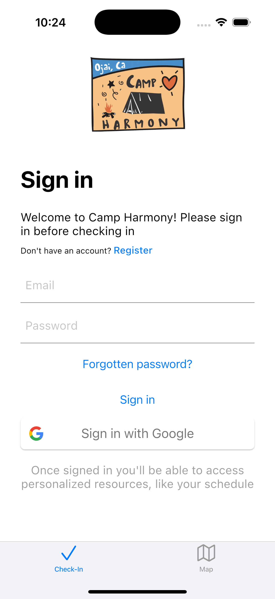
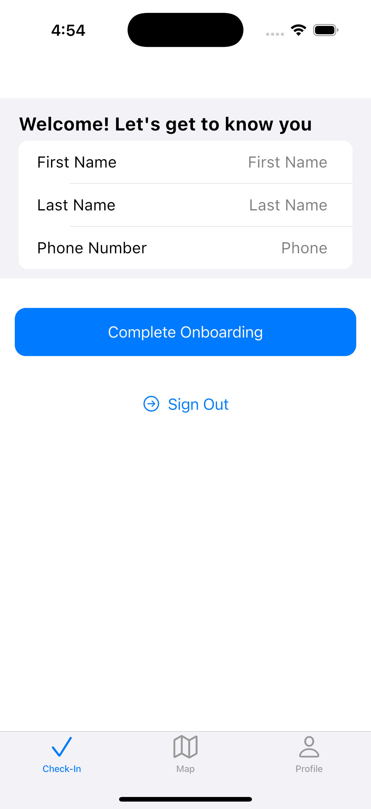
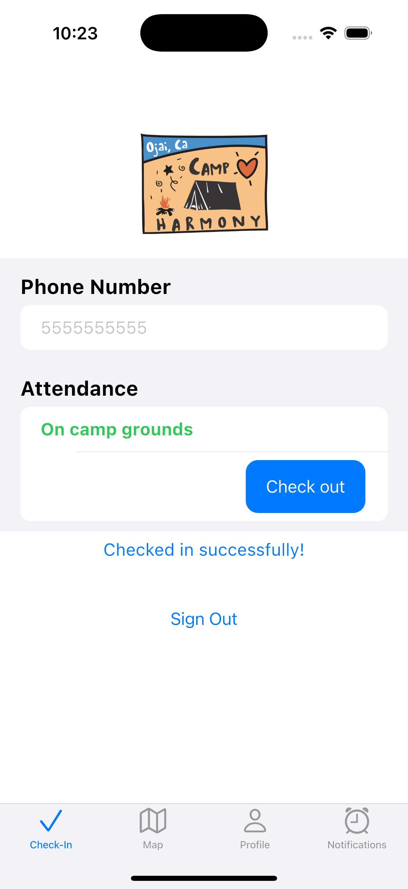
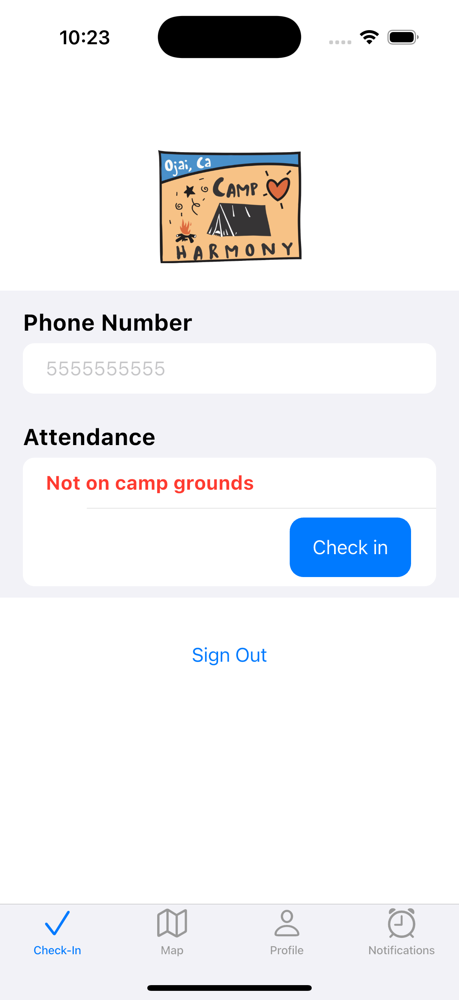
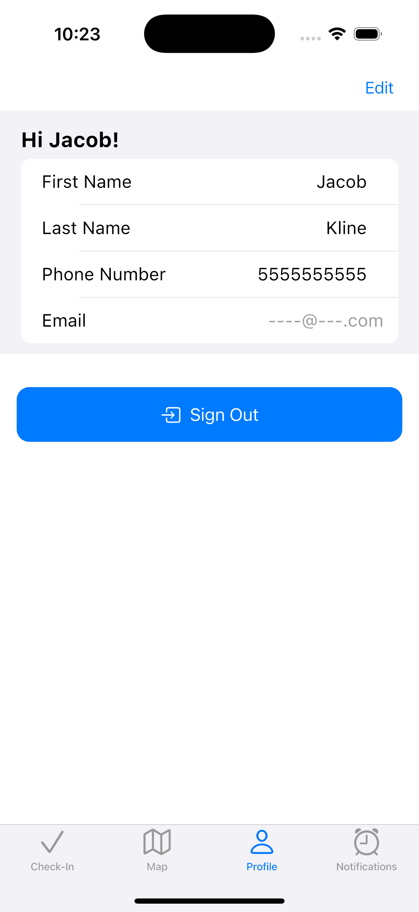
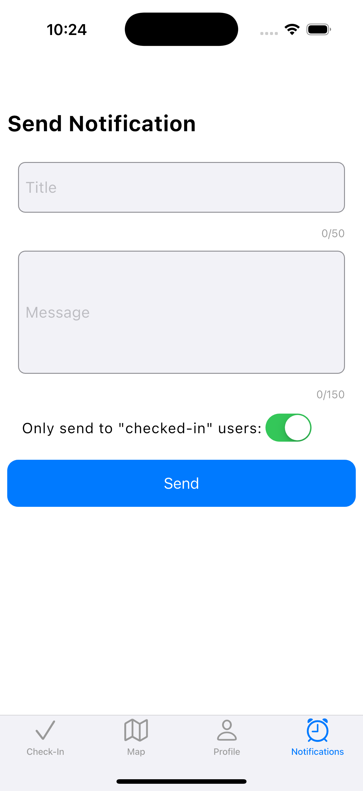
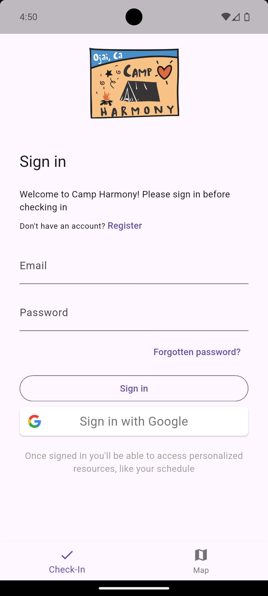
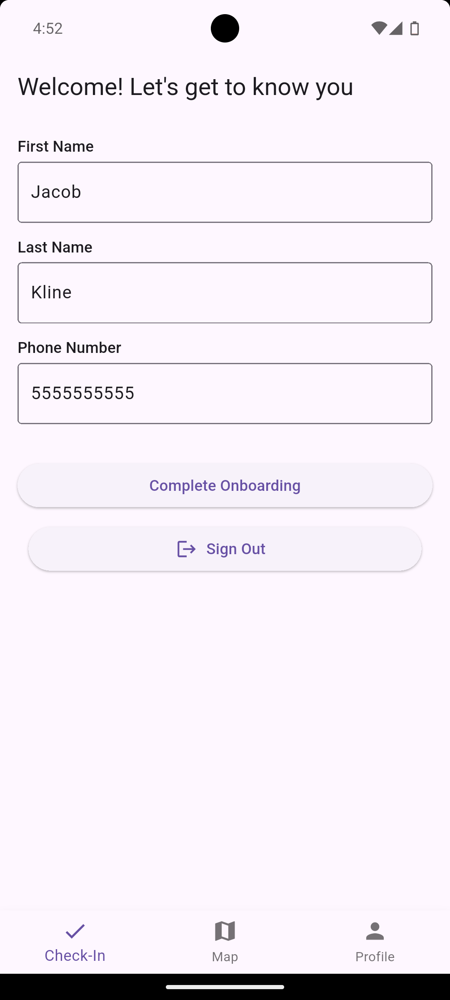
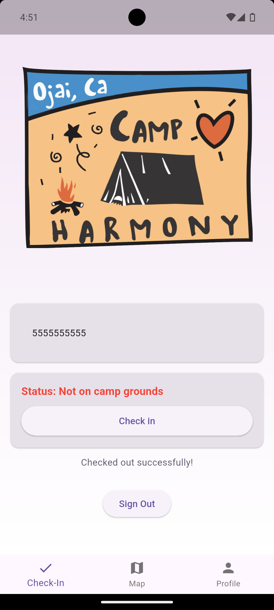
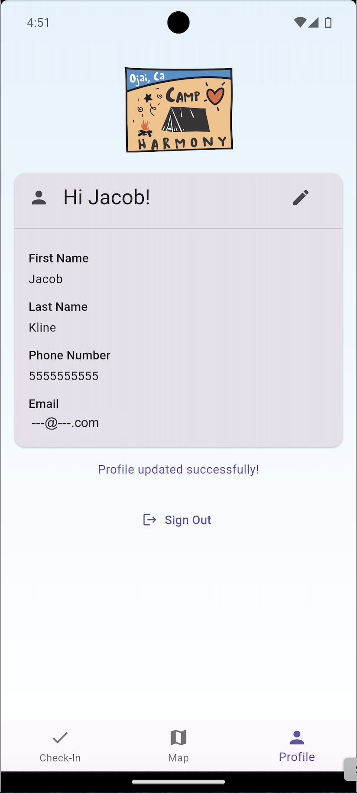

# Camp Harmony Connect

Welcome to the Camp Harmony App! This project is designed to keep track of staff and to streamline and enhance emergency communication for Camp Harmony in California.

## Core Goal

The primary goal of Camp Harmony App is to provide an intuitive, reliable platform for organizing camp events, tracking participant information, and facilitating seamless communication. By centralizing these functions, the app helps camps run more efficiently and creates a better experience for everyone involved.

## Features

- **Staff check-in and check-out:** Easy tracking and profile management for staff.
- **Location mapping:** View your location on the camp map and see where other important landmarks are.
- **Notification sending:** Secure announcements can be sent out by administrators to certain staff members.

## iOS Photos

| Sign-in                                                                  | Onboarding                                                                           | Check-in (checked-in)                                                           |
| ------------------------------------------------------------------------ | ------------------------------------------------------------------------------------ | ------------------------------------------------------------------------------- |
|  |  |  |

| Check-in (checked-out)                                                           | Profile                                                                  | Notification Sending                                                                               |
| -------------------------------------------------------------------------------- | ------------------------------------------------------------------------ | -------------------------------------------------------------------------------------------------- |
|  |  |  |

## Android Photos

| Sign-in                                                                          | Onboarding                                                                             | Check-in                                                                              | Profile                                                                          |
| -------------------------------------------------------------------------------- | -------------------------------------------------------------------------------------- | ------------------------------------------------------------------------------------- | -------------------------------------------------------------------------------- |
|  |  |  |  |

## Project Structure

The repository is organized into several subfolders, each with its own README for more details:

- `camp_harmony_client/` - Contains the client code for managing communication between the front end and the server.
- `camp_harmony_flutter/` - Flutter app for mobile access.
- `camp_harmony_server/` - The serverpod server for data management.

Refer to the individual READMEs in each subfolder for setup instructions and technical details.

## Getting Started

1. Clone the repository.
2. Follow setup instructions in `camp_harmony_client/`, `camp_harmony_flutter/`, and `camp_harmony_server/` folders.
3. Run the app locally or deploy using provided scripts.

## Contributing

We welcome contributions! Please read the guidelines in `ContributorCovenant.md` before submitting pull requests.

## License

This repo is source-available for portfolio review under the Showcase License (see [LICENSE](/LICENSE)). Not for commercial use or redistribution.

---

For questions or support, please contact the project maintainers listed in the `MAINTAINERS.md`.
